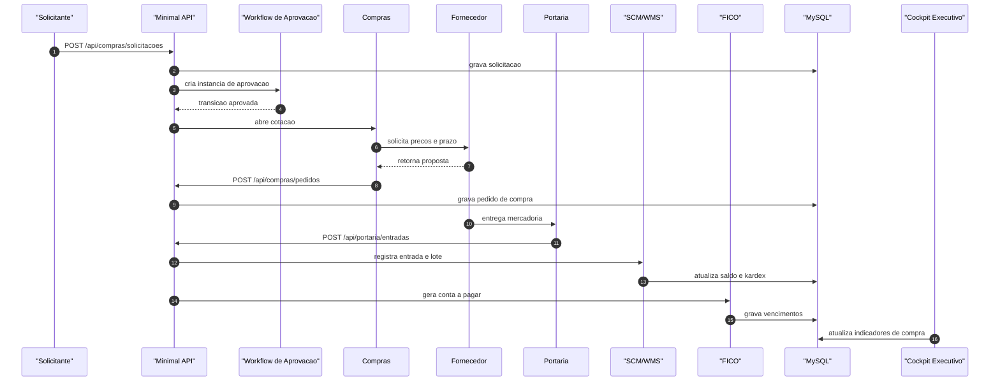

<!--
 * Propriedade intelectual: Luís Rodrigo da Costa
 * Com apoio: IA Chatgpt/Codex que atende por nome: Sophia
 * Sistema de gestão: GenesisGest.Net
 * Ano Início: 04/2024 Publicado e operacional: 05/2026
 * Versão: 1.1.5
-->

# Sequencia de Compra

Fluxo critico: solicitacao, cotacao, aprovacao, pedido, entrada, estoque, contas a pagar e BI.

## Contratos

- Solicitacoes: `POST /api/compras/solicitacoes`
- Cotacoes: `POST /api/compras/cotacoes`
- Pedidos: `POST /api/compras/pedidos`
- Entradas: `POST /api/compras/entradas`
- Portaria: `POST /api/portaria/entradas`
- Financeiro: `POST /api/financeiro/lancamentos`

## Validacao

- Solicitacao nasce vinculada ao tenant.
- Workflow registra aprovador, data e decisao.
- Pedido preserva fornecedor, centro de custo e itens.
- Entrada atualiza estoque com rastreabilidade.
- Conta a pagar criada com vencimento e valor corretos.
- BI reflete compras aprovadas e recebidas.
