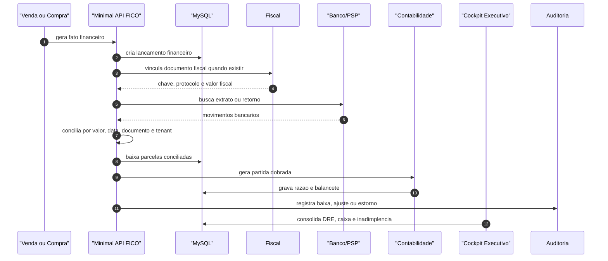

<!--
 * Propriedade intelectual: Luís Rodrigo da Costa
 * Com apoio: IA Chatgpt/Codex que atende por nome: Sophia
 * Sistema de gestão: GenesisGest.Net
 * Ano Início: 04/2024 Publicado e operacional: 05/2026
 * Versão: 1.1.5
-->

# Sequencia Financeiro

Fluxo critico: faturamento, contas a receber, contas a pagar, conciliacao, fechamento e DRE.

## Contratos

- Faturamento: `GET /api/financeiro/faturamento`
- Lancamentos: `POST /api/financeiro/lancamentos`
- Contabil: `POST /api/financeiro/contabil/lancamentos`
- Razao: `GET /api/financeiro/contabil/razao`
- Conciliacao: `POST /api/financeiro/contabil/conciliacao`
- DRE: `GET /api/financeiro/contabil/dre`
- Fechamento: `POST /api/financeiro/contabil/fechamento`

## Validacao

- Lancamento financeiro herda tenant e trilha de auditoria.
- Baixa nao ocorre em parcela ja baixada.
- Conciliacao preserva comprovante e origem.
- Partida contabil fecha debito e credito.
- Fechamento bloqueia alteracoes fora do periodo permitido.
- DRE e cockpit usam os mesmos fatos consolidados.
