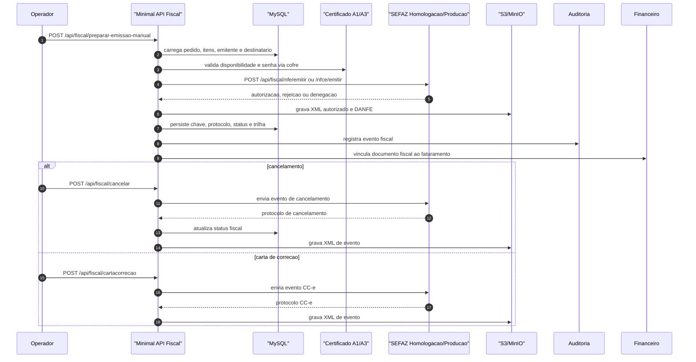

<!--
 * Propriedade intelectual: Luís Rodrigo da Costa
 * Com apoio: IA Chatgpt/Codex que atende por nome: Sophia
 * Sistema de gestão: GenesisGest.Net
 * Ano Início: 04/2024 Publicado e operacional: 05/2026
 * Versão: 1.1.5
-->

# Sequencia Fiscal

Fluxo critico: preparacao, certificado, autorizacao SEFAZ, armazenamento XML, cancelamento e eventos.

## Contratos

- Preparacao: `POST /api/fiscal/preparar-emissao-manual`
- NF-e: `POST /api/fiscal/nfe/emitir`
- NFC-e: `POST /api/fiscal/nfce/emitir`
- Cancelamento: `POST /api/fiscal/cancelar`
- Inutilizacao: `POST /api/fiscal/inutilizar`
- Carta de correcao: `POST /api/fiscal/cartacorrecao`
- SPED: `POST /api/fiscal/sped`

## Validacao

- Certificado vem do cofre, sem segredo em arquivo.
- Ambiente de homologacao fica separado de producao.
- XML autorizado e eventos ficam armazenados.
- Rejeicao SEFAZ retorna codigo e mensagem tratavel.
- Auditoria registra usuario, tenant, entidade e acao.
- Financeiro recebe chave fiscal para conciliacao.
