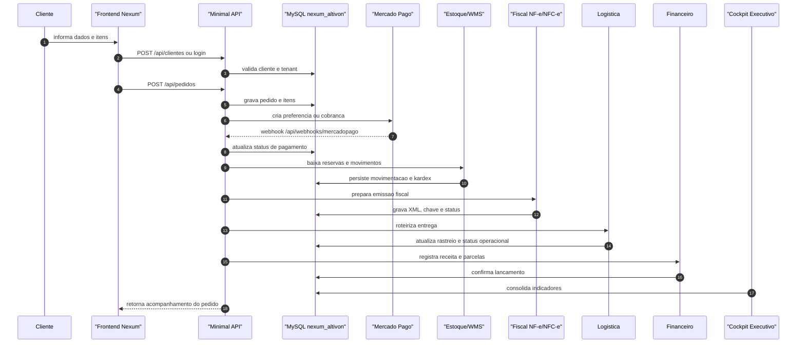

<!--
 * Propriedade intelectual: Luís Rodrigo da Costa
 * Com apoio: IA Chatgpt/Codex que atende por nome: Sophia
 * Sistema de gestão: GenesisGest.Net
 * Ano Início: 04/2024 Publicado e operacional: 05/2026
 * Versão: 1.1.5
-->

# Sequencia de Venda

Fluxo critico: cadastro, carrinho, pedido, pagamento, estoque, fiscal, logistica, financeiro e BI.

## Contratos

- Pedido: `POST /api/pedidos`
- Acompanhamento: `GET /api/pedidos/acompanhar`
- Webhook: `POST /api/webhooks/mercadopago`
- Fiscal: `POST /api/fiscal/nfe/emitir` e `POST /api/fiscal/nfce/emitir`
- Logistica: `POST /api/logistica/roteamento`
- BI: `GET /api/dashboard/resumo`

## Validacao

- Pedido criado com tenant correto.
- Pagamento recebido por webhook e conciliado.
- Estoque movimentado sem quantidade negativa.
- Documento fiscal emitido em homologacao.
- Receita registrada no financeiro.
- Indicadores atualizados no cockpit.
